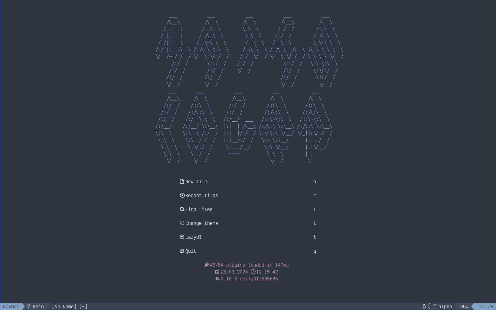
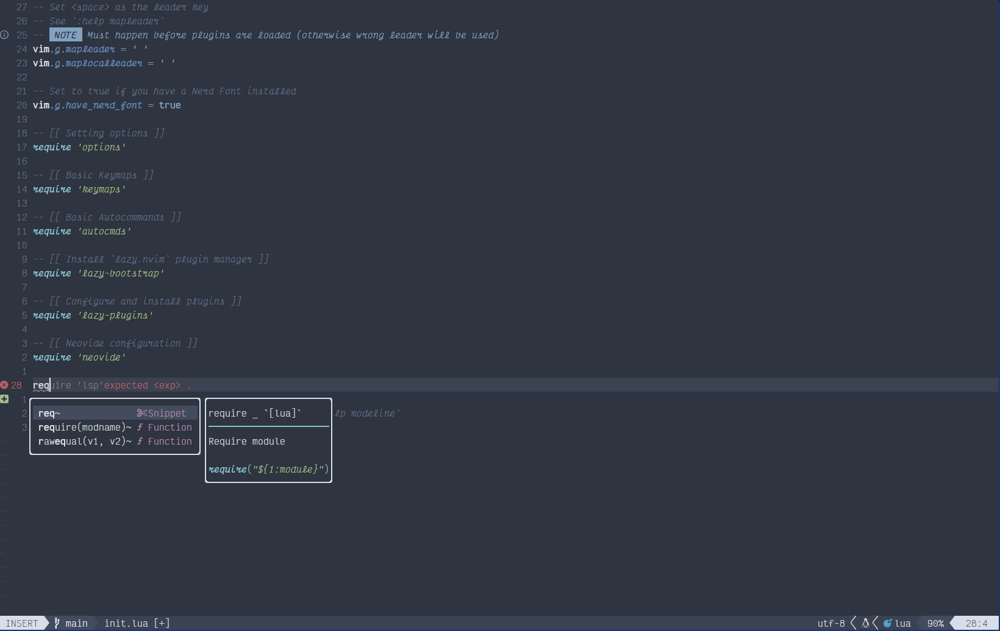

# Neovim config

This neovim config is highly inspired by kickstart and astronvim setups.
Thus many things look similar to them.

To install this config, you need to have [neovim](https://neovim.io/)
installed from the master branch.

## Screenshots

- Startup


- While editing some code


## Installation

To install neovim, we can build the neovim like following:

```bash
git clone https://github.com/neovim/neovim.git

cd neovim

make CMAKE_BUILD_TYPE=Release

sudo make install
```

After installing neovim, we can install the config like following:

```bash
git clone https://github.com/maths-lover/neovim_config ~/.config/nvim

nvim
```

### Startup time

For startuptime and other info, see in detail [here](log.txt)
