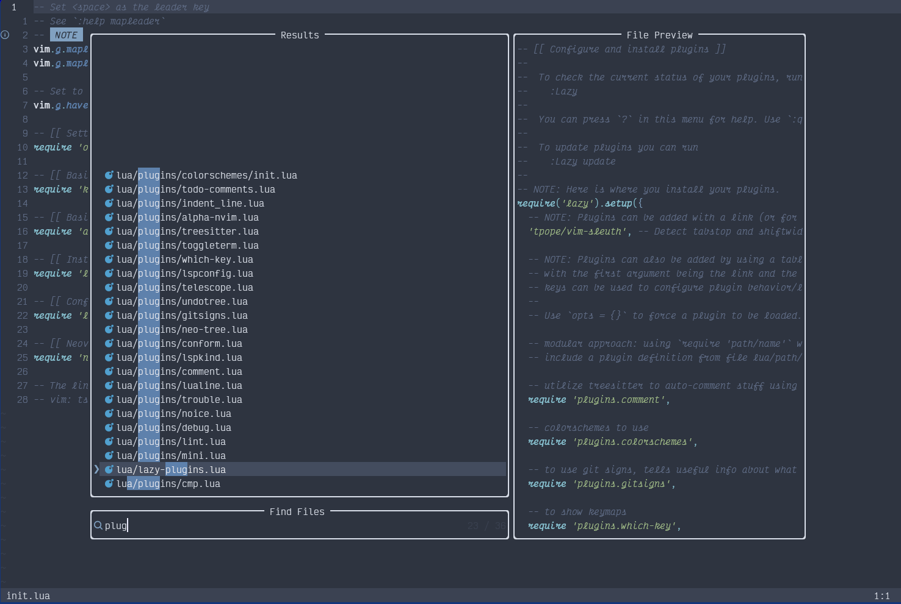
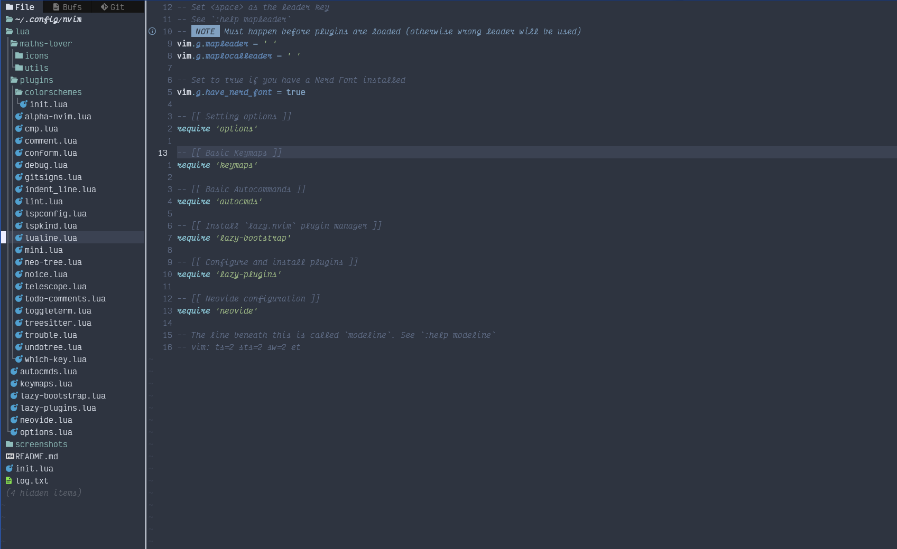
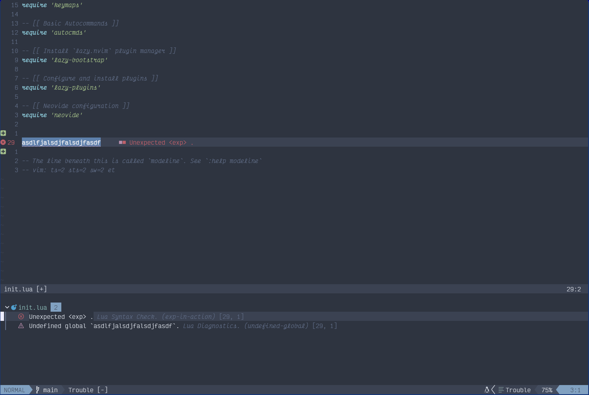

# Neovim config

This neovim config is highly inspired by kickstart and astronvim setups.
Thus many things look similar to them.

To install this config, you need to have [neovim](https://neovim.io/)
installed from the master branch.

## Screenshots

Startup dashboard


While editing some code, cmp, lsp, mason, etc.


Telescope as files finder and much more


Neo-Tree as file explorer


Diagnostics view with noice


## Installation

To install neovim on linux, assuming we have all build dependencies
we can build neovim like following:

```bash
git clone https://github.com/neovim/neovim.git

cd neovim

make CMAKE_BUILD_TYPE=Release

sudo make install
```

> For more info on building neovim for your platform, see [neovim build instructions](https://github.com/neovim/neovim/blob/master/BUILD.md)

After installing neovim, we can install the config like following:

```bash
git clone https://github.com/maths-lover/neovim_config ~/.config/nvim

nvim
```

### Startup time

For startuptime and other info, see in detail [here](log.txt)

## TODO

- [ ] Add support for cheat.sh
